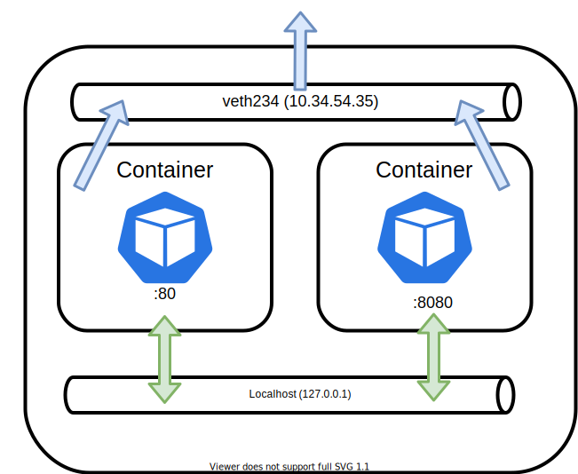

# Understand Multi-Container Pod design patterns

Part 1 documents how Pod manifests can be configured to include multiple containers and also share volumes between them, but as part of a Pod design, identifying **when** to leverage multi container pods.

# How Multi-Container Pods communicate

Pods share a virtual network adapter in order for the containers within to communicate with anything outside the Pod boundary. Additionally, containers within a Pod can communicate over `localhost`.

Sharing storage between containers in a Pod is covered in part 1.

# Deciding between single or multi container Pods

Deciding when or when not to use multi container Pods essentially boils down determining how **tightly coupled** the workloads are.

# Sidecar

Typically used as a "helper" container for the "main" container. Ie:

* File sync services/watchers
* Logging agents
* Traffic manipulation (ie Service Mesh)

By offloading these responsibilities to a sidecar container, it keeps the "main" container lean.

# Ambassador

Ambassador containers, unlike its Sidecar counterpart, are usually in the data path and proxies connections to external services and is typically used for :

* Proxying connections to different environments (ie prod/test/dev) based on Pod spec/configuration

# Adapter 

Adaptor containers typically manipulate / transform output of the main container as required. For example:

* Transforms output generated by the main container to fit a certain standard. For example, as dictated by a monitoring/logging system.

